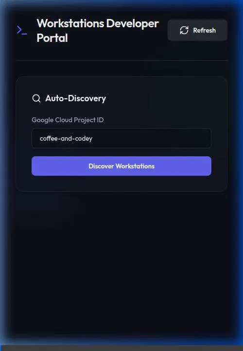
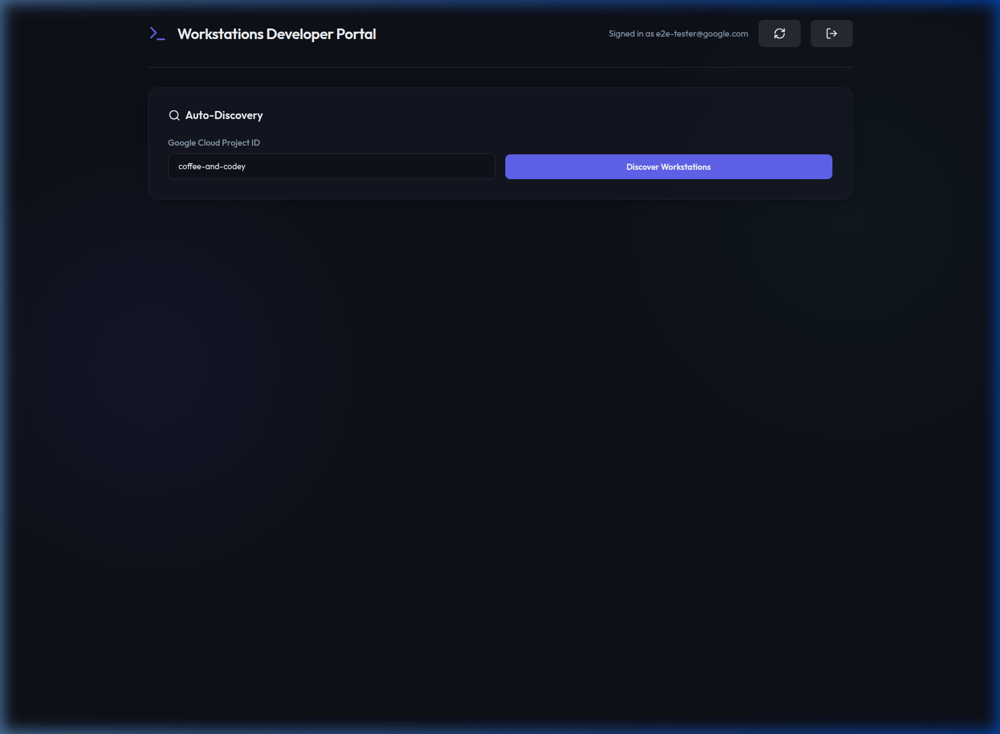
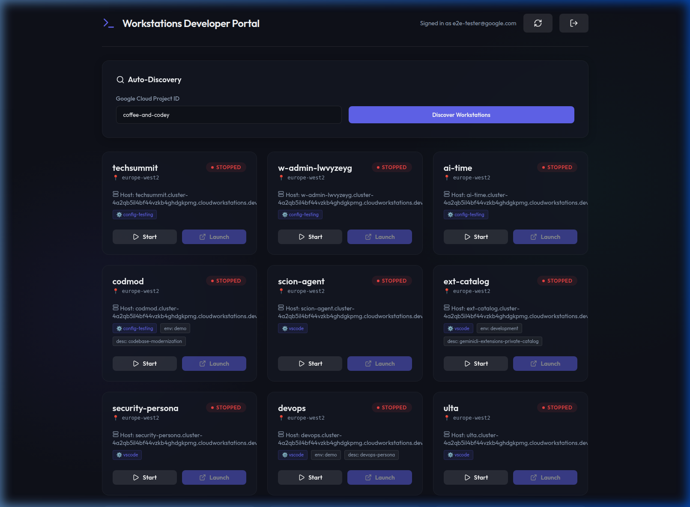

## Overview & Purpose

The **Workstations Developer Portal** is a centralized management interface designed to streamline the developer experience when working with Google Cloud Workstations. In large-scale enterprise environments, managing dozens of workstations across multiple regions and configurations can be cumbersome via the standard Google Cloud Console. 

This portal provides:
- **Centralized Visibility**: See all workstations across all locations and configs in a single, unified view.
- **Improved Discoverability**: Instantly find resources assigned to your project without navigating complex console sub-menus.
- **Optimized Lifecycle Management**: Fast start/stop actions to help manage costs and resource availability.
- **Glassmorphism UI**: A premium, high-performance interface built for speed and aesthetics.

## Features

- **Auto-Discovery**: Automatically find all Workstations available to a specific Google Cloud Project ID.
- **Lifecycle Management**: Start and Stop workstations directly from the UI.
- **Direct Launch**: One-click access to launch into your running Cloud Workstation environments.
- **Live State Updates**: Real-time visualization of workstation states (`RUNNING`, `STOPPED`, `STARTING`, etc.).
- **Automated Testing Bypass**: Built-in support for Service Account token injection for E2E testing and CI/CD pipelines.

## Application in Action

### Session Recording


### Key Screens
**Auto-Discovery View**


**Workstations Discovery**


## Getting Started

### Prerequisites
- Node.js (v18+)
- Active Google Cloud credentials configured (e.g., `gcloud auth application-default login`)
- Permissions to Access Google Cloud Workstations (`roles/workstations.user`)

### Setup and Installation

1. **Install Dependencies**
   ```bash
   npm install
   ```

2. **Start the Backend Server**
   The backend runs on port 3001 and uses the Node.js `@google-cloud/workstations` SDK.
   ```bash
   node server.js
   ```

3. **Start the Frontend Development Server**
   In a separate terminal, start the Vite server.
   ```bash
   npm run dev
   ```

4. **Access the Portal**
   Open your browser to `http://localhost:5173`.

## Testing

For information on how to perform local E2E testing and automated walkthroughs using the Service Account bypass, see the [Local Testing Guide](docs/local-testing.md).

## License

This project is licensed under the Apache License, Version 2.0. See the [LICENSE](LICENSE) file for details.

Copyright 2026 Google LLC
