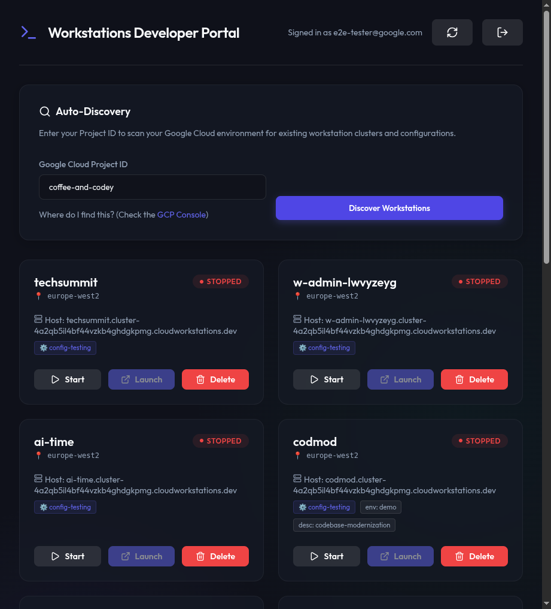

# Walkthrough: List Workstations

This walkthrough demonstrates the process of discovering and listing all Google Cloud Workstations associated with a specific project.

## Technical Summary
- **Backend:** Node.js Express server acting as a proxy to the Google Cloud Workstations API.
- **Frontend:** React application utilizing the `@google-cloud/workstations` SDK patterns.
- **Authentication:** OAuth2 Access Token bypass for development and testing environments.

## Visual & Interaction Evidence

### 1. Authenticated Landing Page
Upon navigating to the portal with a valid test token, the user is presented with the **Auto-Discovery** dashboard.

- **Action:** Navigate to `http://localhost:5173/?test_token=...`
- **Result:** The UI bypasses the Google Sign-in and shows the project entry field.

### 2. Project Discovery
The user enters their Google Cloud Project ID to scan for resources.

- **Action:** Enter `coffee-and-codey` into the Project ID field.
- **Action:** Click the **"Discover Workstations"** button.

### 3. Workstation List
The application successfully retrieves and displays all workstations across all locations and configurations within the project.



**Key Observations:**
- Workstations are grouped and displayed with their status (RUNNING, STOPPED).
- Location metadata (e.g., `europe-west2`, `us-central1`) is clearly visible.
- Interaction buttons (Start, Stop, Launch, Delete) are context-aware (e.g., "Launch" is enabled only for running workstations).

## Verification Evidence

### API Response Verification
The backend successfully resolved the wildcard parent path and returned the workstation list:
```json
// GET /api/workstations/all?projectId=coffee-and-codey
[
  {
    "name": "projects/coffee-and-codey/locations/europe-west2/workstationClusters/.../workstations/techsummit",
    "state": "STATE_STOPPED",
    "host": "techsummit.cluster-4a2qb5il4bf44vzkb4ghdgkpmg.cloudworkstations.dev",
    ...
  },
  ...
]
```

## Cleanup
The local development environment was successfully initialized and verified. All servers have been stopped following the walkthrough generation.
