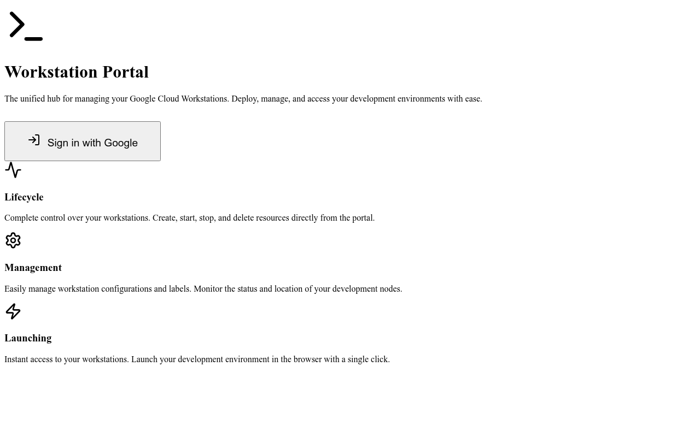
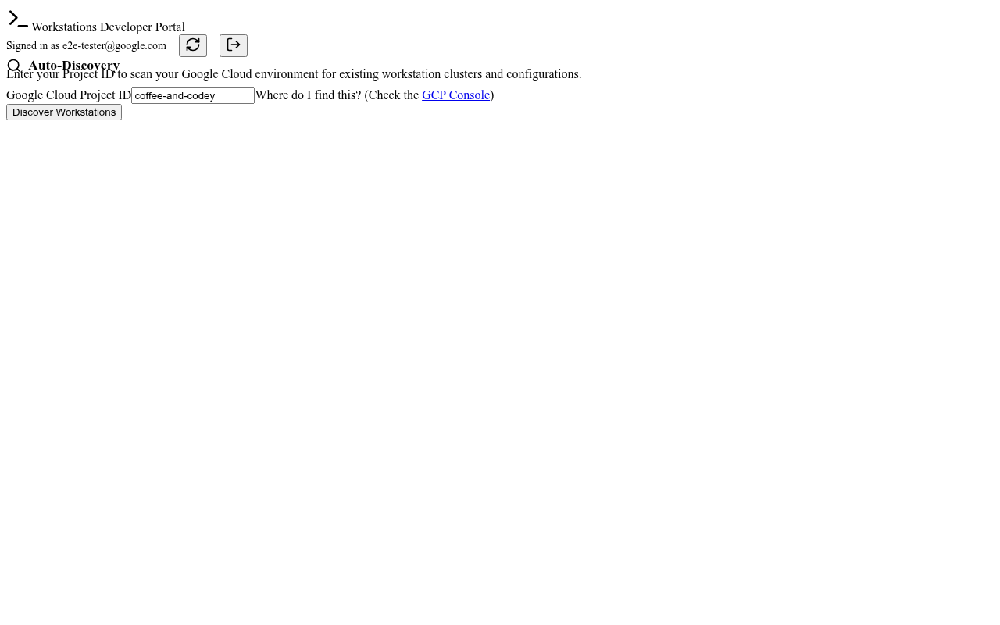

# Feature Walkthrough: Improved Homepage Helpfulness

## Technical Summary
This feature enhances the onboarding experience and overall helpfulness of the Workstations Developer Portal. Key architectural and UI changes include:

1.  **Revised Hero Section**: The homepage now features a more descriptive value proposition for both authenticated and unauthenticated users.
2.  **Feature Grid**: Three key pillars (Lifecycle, Management, Launching) are clearly defined to explain the application's capabilities.
3.  **Discovery Guidance**: The "Auto-Discovery" panel now includes clear instructional text, explaining the need for a Google Cloud Project ID.
4.  **Helpful Links**: Direct links to the GCP Console are provided to assist users in finding their Project ID.

---

## Visual Evidence

### 1. Unauthenticated Homepage
The new landing page provides a clear overview of the portal's features and mission.

### 2. Discovery Guidance (Authenticated)
Once signed in, users are guided on how to discover their workstations using a Project ID.

---

## Verification Evidence

### Automated E2E Tests
We've implemented and verified the feature using Playwright E2E tests.

**Test Results (Chromium):**
- ✅ `Landing Page › should display hero section and feature grid in unauthenticated state`
- ✅ `Discovery Guidance › should display instructional text in discovery panel`

---

## Interactive Walkthrough

To experience the improved helpfulness of the portal, follow these steps in your local environment:

1.  **Launch the Application**: Ensure both the backend (`node server.js`) and frontend (`npm run dev`) are running.
2.  **Landing Page**: Visit `http://localhost:5173`. You will see the new hero section and feature grid highlighting Lifecycle, Management, and Launching capabilities.
3.  **Sign In**: Click the "Sign in with Google" button. (For testing purposes, you can use `http://localhost:5173?test_token=dummy-token` to bypass the actual auth flow).
4.  **Explore Discovery**: Notice the new "Auto-Discovery" panel. It now clearly states: *"Enter your Project ID to scan your Google Cloud environment for existing workstation clusters and configurations."*
5.  **Project ID Helper**: Look at the helper text below the Project ID input: *"Where do I find this? (Check the GCP Console)"*. The link takes you directly to the Google Cloud Console.
6.  **Discover**: Enter a valid Project ID and click "Discover Workstations" to see your resources.

---

## Cleanup
The local development environment should be stopped after verification.

1.  Stop the backend server (Port 3001).
2.  Stop the Vite development server (Port 5173).
